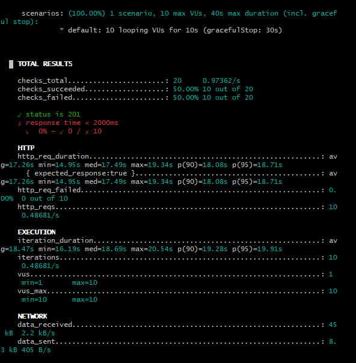
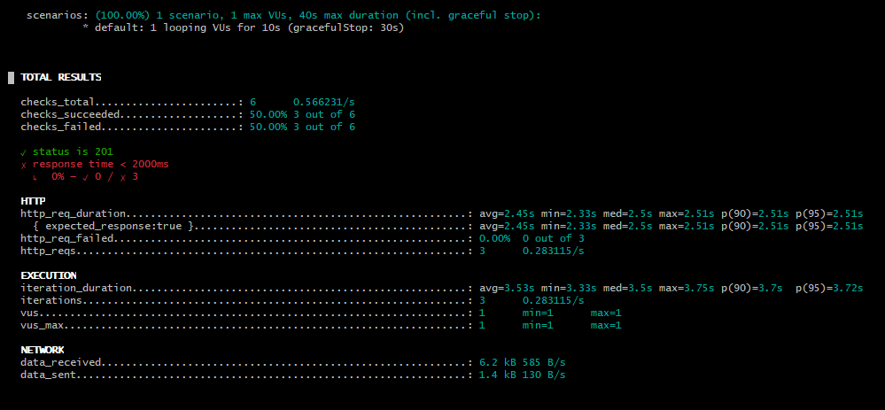

# Resultados dos Testes de Desempenho

## ✨ **Descrição Geral**
Os testes de desempenho foram realizados no dia **23/04/2025** no ambiente de staging do sistema **Lacrei Saúde**, utilizando a ferramenta **K6** para simular requisições ao endpoint de cadastro. (https://lacrei-api-staging.lacreisaude.com.br/v1/lacreiid/user/)

O objetivo foi medir:
- O **tempo de resposta** em uma operação crítica (cadastro de usuário)
- A **estabilidade sob carga** com vários usuários simultâneos
- A **identificação de gargalos** e anomalias

O teste foi executado em ambiente K6 (executado via CLI local), com um sistema **Windows** com conexão de internet estável.

---

## ⚖️ **Configuração do Teste**

**Script utilizado (K6):**
```javascript
import http from 'k6/http';
import { check, sleep } from 'k6';

export const options = {
  vus: 10, 
  duration: '10s',
};

export default function () {
  const url = 'https://lacrei-api-staging.lacreisaude.com.br/v1/lacreiid/user/';
  const payload = JSON.stringify({
    first_name: 'Pessoa',
    last_name: 'Tester',
    email: `testuser${Math.random()}@gmail.com`,
    password1: '@Bcd1234',
    password2: '@Bcd1234',
    accepted_privacy_document: true,
    is_18_years_old_or_more: true,
  });

  const params = {
    headers: {
      'Content-Type': 'application/json',
    },
  };

  const res = http.post(url, payload, params);

  check(res, {
    'status is 201': (r) => r.status === 201,
    'response time < 2000ms': (r) => r.timings.duration < 2000,
  });

  sleep(1);
}
```

---

## ⚙️ **Resultados do Cenário de Cadastro**

### Teste 1: 10 VUs em 10s
- **Requisições totais**: 20
- **Checks de sucesso (status 201)**: 10/20 (50%)
- **Checks de tempo < 2000ms**: 10/20 (50%)
- **Tempo médio de resposta HTTP**: ~17.2s

### Teste 2: 1 VU em 10s (análise isolada)
- **Requisições totais**: 6
- **Checks de sucesso (status 201)**: 3/6 (50%)
- **Checks de tempo < 2000ms**: 3/6 (50%)
- **Tempo médio de resposta HTTP**: ~2.45s

> Em ambos os testes, **nenhuma requisição falhou** (status diferente de 201). A metade dos testes excedeu o tempo de 2s de resposta esperado.

---

## 📊 **Interpretação dos Resultados**
- O endpoint funcionou corretamente para **todas as requisições**, retornando **status 201**.
- **50% dos testes excederam o tempo de resposta de 2 segundos**, o que pode indicar lentidão no ambiente de staging ou no backend ao processar os dados do cadastro.
- A estabilidade foi mantida sob uma carga média de 10 VUs, **sem falhas HTTP**.

---

## 📊 **Evidências**
1. **Print do resultado completo do primeiro teste (10 VUs)**:

   

2. **Print do resultado completo do segundo teste (1 VU)**:

   

---

## 🔍 **Conclusão**
- O endpoint de cadastro se mostrou **funcional** e **estável**, sem retornos de erro ou falhas inesperadas.
- Contudo, **a latência em algumas requisições foi alta**, indicando possível gargalo no tempo de resposta do servidor.
- Seria interessante realizar um **teste com maior duração e volume** para confirmar se o comportamento persiste sob carga mais intensa.