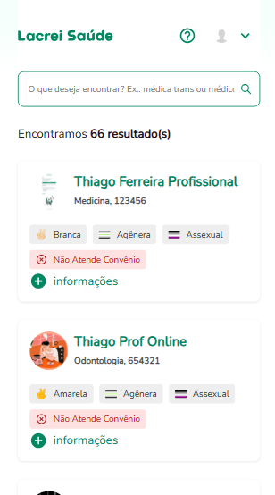
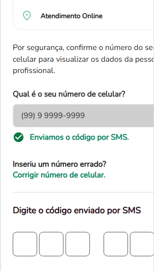

# ✅ Cenários e Casos de Teste

**Software:** https://paciente-staging.lacreisaude.com.br

**QA Responsável:** Rafael de Paiva Florencio Silva  
**Data:** [23/04/2025]

---

## 📌 Feature  : Busca de um profissional de saúde

**Descrição:**  
Validar a busca de um profissional de saúde sob diferentes condições.

---

### 🔹 Caso de Teste: Busca vazia

| Campo               | Informação |
|---------------------|------------|
| **Descrição**       | O usuario verá todos os profissionais ao pesquisar com campo vazio |
| **Prioridade**      | Alta |
| **Tipo de Teste**   | Funcional |
| **Status**          | Sucesso |

**🧩 Pré-condições:**
- O usuário não deve estar cadastrado e logado em uma conta.
- Estar na página de busca de profissionais.

**🧪 Passos:**
1. Acessar págica de busca de profissional.
2. Selecionar campo de busca mas não preencher.
3. Clicar em "Pesquisar" ou apertar "ENTER".

**✅ Resultado Esperado:**
- Será exibido uma lista de todos os profissionais, por todos cumprem os requisitos. (Nenhum)

**📥 Resultado Obtido:**
- Foi exibido a lista dos profissionais.

**📏 Critérios de Aceitação:**
- É exibido a mensagem "Encontramos X Resultado(s)" e uma lista de profissionais é exibida.

**🧾 Pós-condições:**
- O usuario deve selecionar um profissional para ver suas informações.

**🔐 Dados de Teste:**
- Campo de busca: NaN

**📸 Evidência(s):**

---

### 🔹 Caso de Teste: Busca não encontrada

| Campo               | Informação |
|---------------------|------------|
| **Descrição**       | O usuario não deverá encontrar resultados ao pesquisar um profissional que não existe |
| **Prioridade**      | Alta |
| **Tipo de Teste**   | Funcional |
| **Status**          | Sucesso |

**🧩 Pré-condições:**
- O usuário não deve estar cadastrado e logado em uma conta.
- Estar na página de busca de profissionais.

**🧪 Passos:**
1. Acessar págica de busca de profissional.
2. Preencher o campo de busca com um valor que estará indisponível.
3. Clicar em "Pesquisar".

**✅ Resultado Esperado:**
- Será exibido uma mensagem informando que não foram encontros os profissionais requisitados.

**📥 Resultado Obtido:**
- O Profissinal não foi encontrado com sucesso.

**📏 Critérios de Aceitação:**
- É exibido a mensagem "Não encontramos o que você procura."

**🧾 Pós-condições:**
- O usuario deve inserir um valor válido para que posso voltar a pesquisar corretamente.

**🔐 Dados de Teste:**
- Campo de busca: Otorrino

**📸 Evidência(s):**

---

### 🔹 Caso de Teste: Validação por Celular

| Campo               | Informação |
|---------------------|------------|
| **Descrição**       | O usuario deve conseguir submeter um numero de celular para verificação|
| **Prioridade**      | Alta |
| **Tipo de Teste**   | Funcional |
| **Status**          | Sucesso |

**🧩 Pré-condições:**
- O usuário não deve estar cadastrado e logado em uma conta.
- Ter feito uma pesquisa de profissional que haja resultados.

**🧪 Passos:**
1. Acessar págica de resultados.
2. Clicar em um profissional.
3. Clicar em "Exibir contato".
4. Preencher o campo "Qual é o seu número de celular?" com um numero válido.

**✅ Resultado Esperado:**
- Será exibido uma mensagem informando que um codigo foi enviado para o número.

**📥 Resultado Obtido:**
- O pedido para verificação para o celular foi realizado com sucesso.

**📏 Critérios de Aceitação:**
- É exibido a mensagem "Enviamos o código por SMS".

**🧾 Pós-condições:**
- O usuario deve inserir o codigo de verificação recebido para que posso ver os numeros de contato do profissinal.

**🔐 Dados de Teste:**
- Campo de busca: NaN
- Celular: (99) 9 9999-9999

**📸 Evidência(s):**

