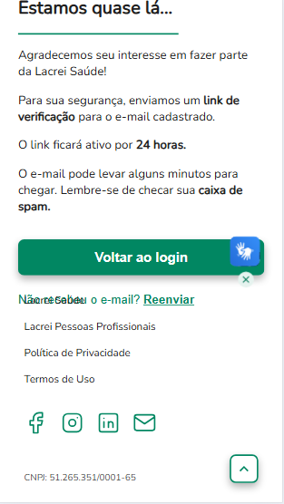
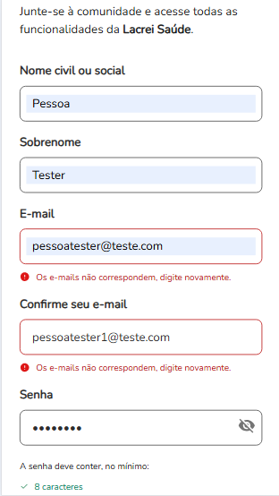

# ✅ Cenários e Casos de Teste

**Software:** https://paciente-staging.lacreisaude.com.br

**QA Responsável:** Rafael de Paiva Florencio Silva  
**Data:** [23/04/2025]

---

## 📌 Feature  : Cadastro da pessoa usuária

**Descrição:**  
Verificar o processo de cadastro de usuario sob diferentes condições.

---

### 🔹 Caso de Teste: Cadastro Parcial com Sucesso

| Campo               | Informação |
|---------------------|------------|
| **Descrição**       | O usuario deverá relizar o processo inicial de cadastro com sucesso |
| **Prioridade**      | Alta |
| **Tipo de Teste**   | Funcional |
| **Status**          | Sucesso |

**🧩 Pré-condições:**
- Estar na página de cadastro de usuário.

**🧪 Passos:**
1. Acessar págica de cadastro de usuário.
2. Preencher todos os campos necessarios.
3. Clicar em "Cadastrar".

**✅ Resultado Esperado:**
- Será exibido mensagem de confirmação de cadastro.

**📥 Resultado Obtido:**
- O processo de cadastro inicial foi executado com sucesso.

**📏 Critérios de Aceitação:**
- É exibido a mensagem "Estamos quase lá..." junto com mais instruções a seguir.

**🧾 Pós-condições:**
- O usuario deve verificar o email inserido via inbox para prosseguir com o cadastro.

**🔐 Dados de Teste:**
- Nome Civil: Pessoa
- Sobrenome: Tester
- Email: pessoatester@teste.com
- Confirme seu email: pessoatester@teste.com
- Senha: @Bcd1234
- Confirme sua senha: @Bcd1234

**📸 Evidência(s):**

---

### 🔹 Caso de Teste: Email não correspondente

| Campo               | Informação |
|---------------------|------------|
| **Descrição**       | O usuario não deverá concluir o cadastro ou inserir email errados |
| **Prioridade**      | Medio |
| **Tipo de Teste**   | Funcional |
| **Status**          | Sucesso |

**🧩 Pré-condições:**
- Estar na página de cadastro de usuário.

**🧪 Passos:**
1. Acessar págica de cadastro de usuário.
2. Preencher os campos "Email" e "Confirme seu email" com valores diferentes.
3. Preencher o resto dos campos.
4. Clicar em "Cadastrar".

**✅ Resultado Esperado:**
- O usuaria será informa que campos de email não correspondem, pois ambos devem ser o mesmo.

**📥 Resultado Obtido:**
- O aviso foi imprimido com sucesso e o cadastro não prosseguiu.

**📏 Critérios de Aceitação:**
- É exibido a mensagem "Os e-mails não correspondem, digite novamente."

**🧾 Pós-condições:**
- O usuario deve inserir valores de email iguais para os campos "Email" e "Confirme seu email" para prosseguir

**🔐 Dados de Teste:**
- Nome Civil: Pessoa
- Sobrenome: Tester
- Email: pessoatester@teste.com
- Confirme seu email: pessoatester1@teste.com
- Senha: @Bcd1234
- Confirme sua senha: @Bcd1234

**📸 Evidência(s):**

---

### 🔹 Caso de Teste: Pós-Cadastro com Sucesso

| Campo               | Informação |
|---------------------|------------|
| **Descrição**       | O usuario deve conseguir submeter um numero de celular para verificação |
| **Prioridade**      | Alta |
| **Tipo de Teste**   | Funcional |
| **Status**          | Falha |

**🧩 Pré-condições:**
- O usuário ter realizado a etapa inicial de cadastro e verificado o email via inbox.
- O usuario deve logar com a conta cadastrada e verificada pela primeira vez.

**🧪 Passos:**
1. Acessar pós-cadastro.
2. Clicar em continuar cadastro.
3. Clicar nos radio buttons desejadas e em "Próximo" até a 5° parte.
4. Clicar em quantas checkboxes desejar.
5. Clicar em "Concluir".
4. Cliar em "Buscar Profissional".

**✅ Resultado Esperado:**
- O usuario será redirecionado para a pagina de busca de profissionais.

**📥 Resultado Obtido:**
- A página redirecionou o usuário de volta para o inicio do pós-cadastro novamente.

**📏 Critérios de Aceitação:**
- Ir para a página de busca de profissionais.

**🧾 Pós-condições:**
- O usuario precisa inserir os valores novamente para que sera redirecionado corretamente.

**📸 Evidência(s):**

- [Vídeo](https://youtube.com/shorts/BAskgDs0U1A?feature=share)