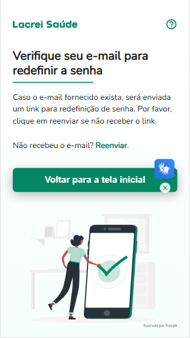
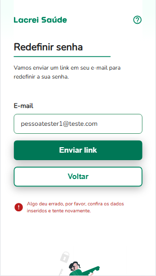

# ✅ Cenários e Casos de Teste

**Software:** https://paciente-staging.lacreisaude.com.br

**QA Responsável:** Rafael de Paiva Florencio Silva  
**Data:** [23/04/2025]

---

## 📌 Feature  : Esquecer senha e resetar

**Descrição:**  
Verificar o processo de reset de senha sob diferentes condições.

---

### 🔹 Caso de Teste: Requisição com sucesso

| Campo               | Informação |
|---------------------|------------|
| **Descrição**       | O usuario deverá relizar parcialmente o processo de mudança de senha com sucesso |
| **Prioridade**      | Alta |
| **Tipo de Teste**   | Funcional |
| **Status**          | Sucesso |

**🧩 Pré-condições:**
- O usuario deve estar cadastrado.
- O usuario não deve estar logado.
- O usuario deve estar na página de redefinição de senha.

**🧪 Passos:**
1. Acessar a pagina de redefinição de senha.
2. Preencher o campo necessario com um email previamente cadastrado.
3. Clicar em "Enviar Link".

**✅ Resultado Esperado:**
- Será exibido mensagem de confirmação de requisição.

**📥 Resultado Obtido:**
- As credenciais novas foram exibidas em vez das antigas.

**📏 Critérios de Aceitação:**
- É exibido a mensagem "Verifique seu e-mail para redefinir a senha" junto com mais instruções a seguir.

**🧾 Pós-condições:**
- O usuario deve verificar o email inserido via inbox para prosseguir com o reset.

**📸 Evidência(s):**

---

### 🔹 Caso de Teste: Requisição vazia

| Campo               | Informação |
|---------------------|------------|
| **Descrição**       | O usuario não deverá prosseguir com a requisição com campo vazio |
| **Prioridade**      | Medio |
| **Tipo de Teste**   | Funcional |
| **Status**          | Sucesso |

**🧩 Pré-condições:**
- O usuario deve estar na página de redefinição de senha.

**🧪 Passos:**
1. Acessar a pagina de redefinição de senha.
2. Selecionar o campo email e desselecionar sem inserir um valor

**✅ Resultado Esperado:**
- Um aviso de que o usuario deve preencher o campo será exibido.

**📥 Resultado Obtido:**
- O pedido de preenchimento do campo foi exibido como esperado.

**📏 Critérios de Aceitação:**
- O usuario deve ver o aviso "Por favor, utilize um formato de e-mail válido. Por exemplo: email@dominio.com.br".

**🧾 Pós-condições:**
- O usuario deve preencher o campo com um email ja cadastrado para que possa prosseguir

**📸 Evidência(s):**

---

### 🔹 Caso de Teste: Requisição errada

| Campo               | Informação |
|---------------------|------------|
| **Descrição**       | O usuario não deverá prosseguir com a requisição com campo errado |
| **Prioridade**      | Medio |
| **Tipo de Teste**   | Funcional |
| **Status**          | Sucesso |

**🧩 Pré-condições:**
- O usuario deve estar na página de redefinição de senha.

**🧪 Passos:**
1. Acessar a pagina de redefinição de senha.
2. Preencher o campo necessario com um email não cadastrado.
3. Clicar em "Enviar Link".

**✅ Resultado Esperado:**
- O usuario não deverá concluir a requisição e um aviso de erro deve ser exibido.

**📥 Resultado Obtido:**
- O usuario não pode prosseguir como esperado e um aviso foi exibido.

**📏 Critérios de Aceitação:**
- O usuario deve ver o aviso "Algo deu errado, por favor, confira os dados inseridos e tente novamente."

**🧾 Pós-condições:**
- O usuario deve preencher o campo com um email ja cadastrado para que possa prosseguir

**🔐 Dados de Teste:**
- Email: pessoatester1@gmail.com

**📸 Evidência(s):**
