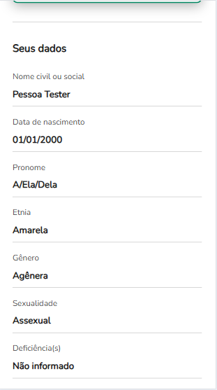
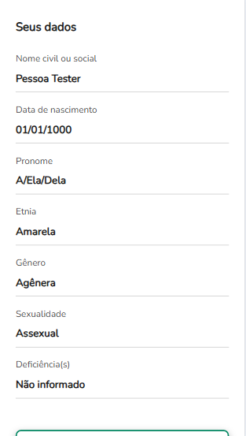
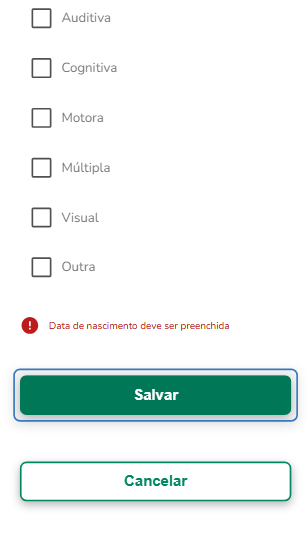

# ✅ Cenários e Casos de Teste

**Software:** https://paciente-staging.lacreisaude.com.br

**QA Responsável:** Rafael de Paiva Florencio Silva  
**Data:** [23/04/2025]

---

## 📌 Feature  : Edição de perfil da pessoa usuária

**Descrição:**  
Verificar o processo de edição de perfil sob diferentes condições.

---

### 🔹 Caso de Teste: Editar com valor realista

| Campo               | Informação |
|---------------------|------------|
| **Descrição**       | O usuario deverá relizar o processo de mudança de credenciais com sucesso |
| **Prioridade**      | Alta |
| **Tipo de Teste**   | Funcional |
| **Status**          | Sucesso |

**🧩 Pré-condições:**
- O usuário não deve estar cadastrado e logado em uma conta.
- O usuário deve estár na página de edição de perfil

**🧪 Passos:**
1. Acessar a pagina de edição de perfil.
2. Preencher todos os campos necessarios com valores realistas.
3. Clicar em "Salvar".

**✅ Resultado Esperado:**
- O usuario retornará para a página de perfil com os valores atualizado.

**📥 Resultado Obtido:**
- O processo de mudança de credenciais inicial foi executado com sucesso.

**📏 Critérios de Aceitação:**
- Os novos valores de perfil devem ser exatamente os inseridos pelo usuário.

**🔐 Dados de Teste:**
- Nome Civil: Pessoa
- Sobrenome: Tester
- Data de nascimento: 01/01/2000

**📸 Evidência(s):**

---

### 🔹 Caso de Teste: Editar com valor irrealista

| Campo               | Informação |
|---------------------|------------|
| **Descrição**       | O usuario não deverá concluir a edição ao inserir valores irrealistas |
| **Prioridade**      | Medio |
| **Tipo de Teste**   | Funcional |
| **Status**          | Falha |

**🧩 Pré-condições:**
- O usuário não deve estar cadastrado e logado em uma conta.
- O usuário deve estár na página de edição de perfil

**🧪 Passos:**
1. Acessar a pagina de edição de perfil.
2. Preencher todos os campos necessarios com valores irrealistas como ano de nascimento abaixo de 1900.
3. Clicar em "Salvar".

**✅ Resultado Esperado:**
- A atualização de informações deve ser negada.

**📥 Resultado Obtido:**
- As novas informações foram enviadas com sucesso.

**📏 Critérios de Aceitação:**
- O usuario não deveria conseguir prosseguir com o salvamento e os valores no perfil não devem ser alterados.

**🧾 Pós-condições:**
- O usuario deve inserir valores de forma realista para aumentar a chance de credenciais legítimas.

**🔐 Dados de Teste:**
- Nome Civil: Pessoa
- Sobrenome: Tester
- Data de nascimento: 01/01/1000

**📸 Evidência(s):**

- [Vídeo](https://youtube.com/shorts/4ElWzKUpz_8?feature=share)
---

### 🔹 Caso de Teste: Editar com campo vazio 

| Campo               | Informação |
|---------------------|------------|
| **Descrição**       | O usuario não deverá concluir a edição ao deixar campos vazios |
| **Prioridade**      | Medio |
| **Tipo de Teste**   | Funcional |
| **Status**          | Sucesso |

**🧩 Pré-condições:**
- O usuário não deve estar cadastrado e logado em uma conta.
- O usuário deve estár na página de edição de perfil

**🧪 Passos:**
1. Acessar a pagina de edição de perfil.
2. Alterar ou deixar ao menos um campo com valor vazio como a data de nascimento.
3. Clicar em "Salvar".

**✅ Resultado Esperado:**
- O usuario não deverá concluir a edição.

**📥 Resultado Obtido:**
- A edição foi negada e foi solicitada a correção de valores.

**📏 Critérios de Aceitação:**
- A edição não salva e é exibido a mensagem "[Nome do campo] deve ser preenchida(o)".

**🧾 Pós-condições:**
- O usuario precisa inserir todos os valores necessarios para que as mudanças sejam efetivadas.

**🔐 Dados de Teste:**
- Nome Civil: Pessoa
- Sobrenome: Tester
- Data de nascimento: dd/mm/aaaa

**📸 Evidência(s):**

